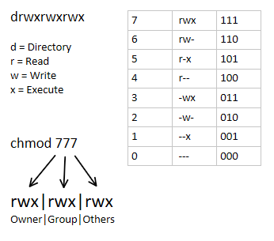

En Unix, los permisos de archivo se dividen en lectura, escritura y ejecución para el propietario, grupo y otros. 

Por ejemplo, el comando chmod 754 archivo.txt establece permisos de lectura, escritura y ejecución para el propietario, lectura y ejecución para el grupo, y solo lectura para los demás.

